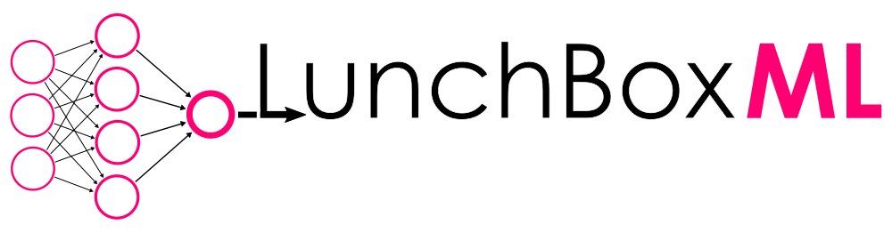

# What is LunchBoxML? #

LunchBoxML is a Grasshopper library extension to [LunchBox](http://provingground.io/tools/lunchbox/) that exposes general purpose machine learning solvers using the [Accord.NET](http://accord-framework.net/) framework

### Who maintains LunchBoxML? ###

* LunchBoxML was originally co-authored by [Nazanin Alsadat Tabatabaei Anaraki](https://www.linkedin.com/in/nazanin-alsadat-tabatabaei-anaraki-63989213a/) and [Nathan Miller](https://provingground.io/about/nathan-miller/) as part of Proving Ground's 2017 [Summer Research internship](https://provingground.io/careers/internships/)
* LunchBoxML is maintained by [Proving Ground](http://provingground.io)
* If you have questions, visit our [LunchBox Website](http://provingground.io/tools/lunchbox/)

### How do I get started? ###

* Current LunchBoxML builds as part of the official LunchBox installer [Click Once installer link.](http://provingground-lunchbox.s3-website-us-east-1.amazonaws.com/lunchbox.installer.application)
* You can also build the Conduit project from the source code (Visual Studio 2015 C# Project)

Requirements:

* [Rhinoceros 5.0 (64-Bit)](https://www.rhino3d.com/)
* [Grasshopper](http://www.grasshopper3d.com/)
* [Accord.NET](http://accord-framework.net/) - LunchBox installer will distribute with the latest version. Conflicting versions from other plugins may create problems with LunchBoxML

### Are you interested in customizing your own machine learning app? ###
[Check out our software customization service!](https://provingground.io/services/projects/custom-tools-automation/)

### How can I contribute? ###

If you have come across bugs or have wish list items, [submit them to the Issues section of the LunchBoxML repo.](https://bitbucket.org/archinate/LunchBoxML/issues?status=new&status=open)

If you have built some cool stuff for LunchBoxML and would like to share it back with the official project, you can follow these steps...

*  Fork the LunchBoxML repository
*  Make cool stuff.
*  Submit a Pull request.

### GNU Lesser General Public License ###

LunchBoxML is an open source project under the [GNU Lesser General Public](http://opensource.org/licenses/MIT) license

Copyright (c) 2017 [Proving Ground LLC](http://ProvingGround.io)

This library is free software; you can redistribute it and/or modify it
under the terms of the GNU Lesser General Public License as published by
the Free Software Foundation; either version 2.1 of the License, or (at 
your option) any later version.

The copyright holders provide no reassurances that the source code provided
does not infringe any patent, copyright, or any other intellectual property
rights of third parties. The copyright holders disclaim any liability to 
any recipient for claims brought against recipient by any third party for 
infringement of that parties intellectual property rights.

This library is distributed in the hope that it will be useful, but WITHOUT
ANY WARRANTY; without even the implied warranty of MERCHANTABILITY or 
FITNESS FOR A PARTICULAR PURPOSE. See the GNU Lesser General Public License
for more details.